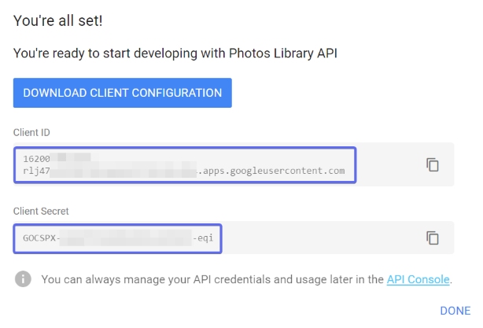

# Google Photos for Obsidian

This plugin let's you embed Google Photos images directly into Obsidian. When you select an image, it will save and embed a low-res thumbnail with a link back to the full-res image on Google Photos.

If your note title has a detectable date, you can have the plugin default to showing you only photos from that date. There is a toggle at the top to show all photos instead.

# How to set up

To connect to Google Photos from a third-party plugin, you will need to create an API key for the plugin to use.

**The plugin will only request read-only access. It is not able to modify your photos or albums.**

1. Visit [https://developers.google.com/photos/library/guides/get-started](https://developers.google.com/photos/library/guides/get-started)

2. Click the button that looks like this:

3. Create a new project and give it any name you like. 
Use the same name on the next screen which asks for the "product name":

4. Fill in these settings for the OAuth configuration screen:

Redirect URI: `https://localhost/google-photos`

5. Click **Create**.

6. Copy the `Client ID` and `Client Secret`. You will need to add these values into the Obsidian plugin settings:

